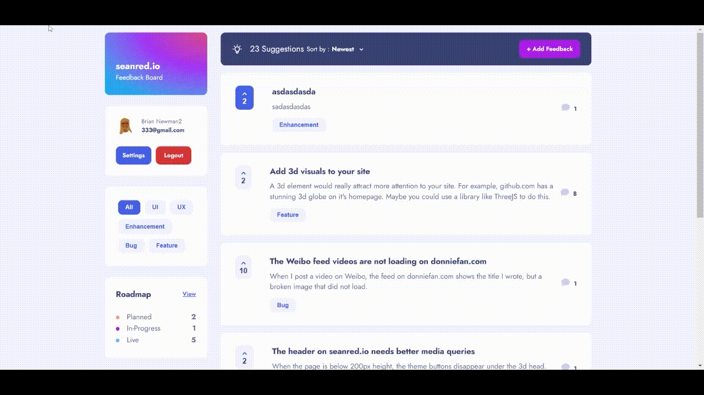
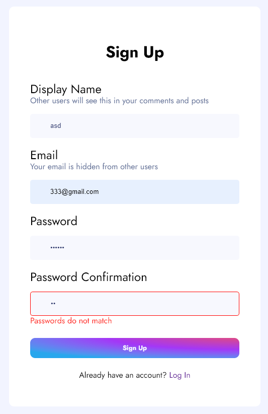

# seanred.io feedback app

This full stack app is a message board for giving feedback to seanred.io.

## Table of contents

- [Overview](#overview)
  - [User Stories](#user-stories)
  - [Screenshot](#screenshot)
  - [Links](#links)
- [My process](#my-process)
  - [Built with](#built-with)
  - [What I learned](#what-i-learned)
  - [Continued development](#continued-development)
- [Author](#author)

## Overview

### User Stories

Users should be able to:

- View the optimal layout for the app depending on their device's screen size
- See hover states for all interactive elements on the page
- Create, read, update, upvote, and delete feedback posts
- Receive form validations when trying to create/edit feedback posts
- Sort suggestions by most/least upvotes and most/least comments
- Filter suggestions by category
- Add comments and replies to a feedback post
- Create an account login, logout
- Change email, name, password, profile picture
- Only change their own posts and account details
- See which suggestions are in progress or implemented

### Screenshots



### Links

- Front-end GitHub URL: [https://github.com/seanred360/product-feedback-app]
- Back-end GitHub URL: [https://github.com/seanred360/product-feedback-app-backend]
- Live Site URL: [https://seanredfeedback.netlify.app/]

## My process

### Built with

- [MongoDB](https://www.mongodb.com/)
- [Express](https://expressjs.com/)
- [React](https://reactjs.org/) - JS library
- [NodeJS](https://nodejs.org/en/)

#### Configuring environment variables

I learned very quickly that my API keys will be exposed if I save them inside the frontend. So I learned the proper way to configure the app for dev and production environments and NOT TO COMMIT THE .ENV FILE TO GITHUB. Netlify makes this extremly easy to configure in production.

#### Creating a login system with Firebase

```js
const app = firebase.initializeApp({
  apiKey: process.env.REACT_APP_FIREBASE_API_KEY,
  authDomain: process.env.REACT_APP_FIREBASE_AUTH_DOMAIN,
  projectId: process.env.REACT_APP_FIREBASE_PROJECT_ID,
  storageBucket: process.env.REACT_APP_FIREBASE_STORAGE_BUCKET,
  messagingSenderId: process.env.REACT_APP_FIREBASE_MESSAGING_SENDER_ID,
  appId: process.env.REACT_APP_FIREBASE_APP_ID,
  measurementId: process.env.REACT_APP_FIREBASE_MEASUREMENT_ID,
});
```

I had no idea where to start with this one, so I used Firebase's api to impliment a login system. Now that I see how it works, I could definitly make my own login system on the next project. I saved a lot of time here by using Firebase and not reinventing the wheel. I created a useContext hook to share the current user and common functions with all the components in the app.

```js
const AuthProvider = ({ children }) => {
  const [currentUser, setCurrentUser] = useState();
  const [loading, setLoading] = useState(true);

  function login(email, password) {
    return auth.signInWithEmailAndPassword(email, password);
  }

  function logout() {
    auth.signOut();
  }

  function resetPassword(email) {
    return auth.sendPasswordResetEmail(email);
  }
```

#### Creating private routes

```html
<Switch>
  <PrivateRoute exact path="/" component="{HomePage}" />
  <PrivateRoute path="/road-map" component="{RoadMapPage}" />
  <PrivateRoute path="/account" component="{AccountPage}" />
  <PrivateRoute path="/edit-account-email" component="{EditAccountEmailPage}" />
  <PrivateRoute path="/edit-account" component="{EditAccountNamePage}" />
  <PrivateRoute path="/update-profile" component="{UpdateProfilePage}" />
  <PrivateRoute path="/new" component="{PostFeedbackPage}" />
  <PrivateRoute path="/edit/:slug" component="{EditFeedbackPage}" />
  <PrivateRoute path="/reset-password" component="{ResetPasswordPage}" />
  <PrivateRoute path="/sign-up" isPublic="{true}" component="{SignupPage}" />
  <Route path="/log-in" component="{LoginPage}" />
  <Route path="/not-found" component="{NotFoundPage}" />
  <PrivateRoute path="/:slug" component="{ViewFeedbackPage}" />
</Switch>
```

This was a totally foreign concept to me. How does one restrict access to certain pages for certain users? Appearently it isn't very complicated with React. I just created a wrapper component for the route component.

```js
const PrivateRoute = ({ component: Component, isPublic = false, ...rest }) => {
  const { currentUser } = useAuth();
  return (
    <Route
      {...rest}
      render={({ location }) => {
        return currentUser ? (
          <Component {...location} />
        ) : (
          <Redirect
            to={{
              pathname: "/log-in",
              state: { from: location },
            }}
          />
        );
      }}
    />
  );
};
```

All this component does is check if the user is logged in, if not, then redirect the user to the login page. This stops the user from visiting pages like the account page.

#### Form validation with joi

[Joi](https://joi.dev)



This is my first time using a schema description language. It is much easier to make a schema of your forms and compare the user's input to the schema, than to make your own new rules for every form you make. Joi also creates an error object that can be used to disable buttons and display error messages.

```js
const validateProperty = ({ name, value }) => {
  const obj = { [name]: value };
  const propertySchema = { [name]: Joi.string().required() };
  const { errors } = Joi.validate(obj, propertySchema);
  return errors ? errors.details[0].message : null;
};

const handleChange = (input) => {
  const errors = { ...error };
  const errorMessage = validateProperty(input);
  if (errorMessage) errors[input.name] = errorMessage;
  else delete errors[input.name];

  const data = { ...formData };
  data.content = input.value;

  setFormData(data);
  setError(errors);
};
```

### Continued development

I hope to take what I learned from making this app and add social media functionality to my teaching website. That way I can communicate with my clients through the site rather than Wechat.

## Author

- Website - [Sean Redmon](https://seanred.io)
- GitHub - [Sean Redmon](https://github.com/seanred360)

```

```
